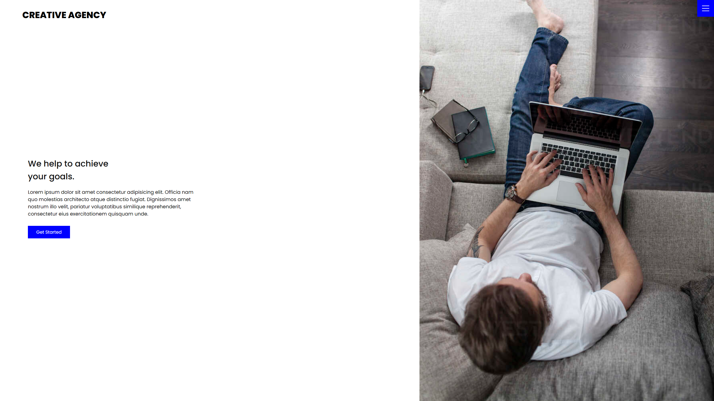
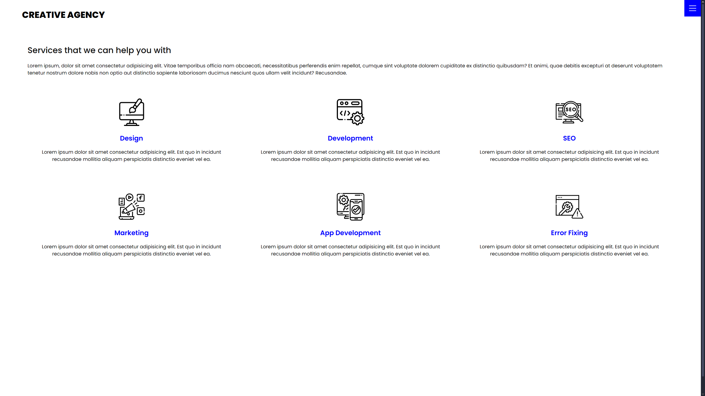
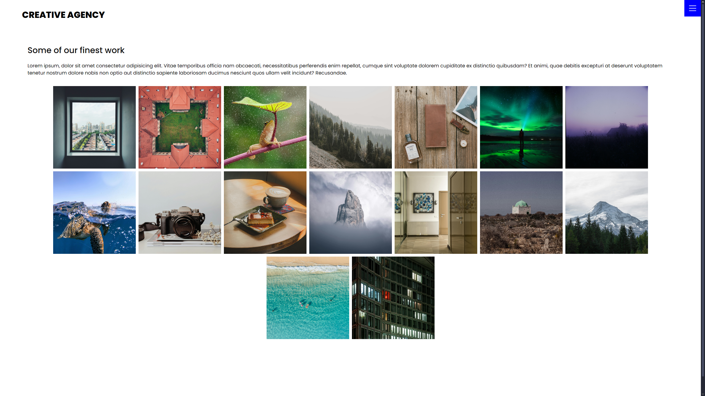
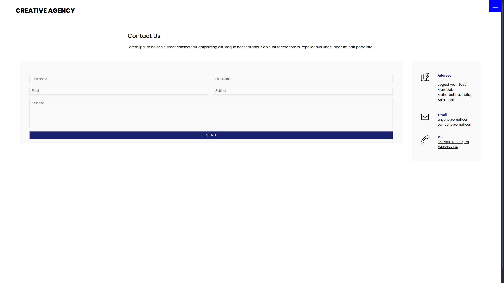

# Creative Agency Website

A modern, responsive website template tailored for creative agencies. This project helps agencies showcase their portfolios, highlight services, and connect with potential clients through a visually appealing and interactive web presence.

## Features

- **Home Page:** Attractive and engaging landing section to introduce your agency.
- **Service Listings:** Clearly presents the range of services offered.
- **Portfolio Gallery:** Interactive gallery for showcasing previous work.
- **Contact Form:** Easy-to-use form for client inquiries.
- **Responsive Design:** Optimized for all devices—desktops, tablets, and smartphones.
- **User-Friendly Interface:** Minimal and modern design for smooth navigation.
- **Animations & Effects:** Subtle transitions and effects for enhanced user experience.

## Languages Used

- **HTML:** Structure and layout of web pages.
- **CSS:** Styling, layout control, and responsive design.
- **JavaScript:** Interactivity, dynamic content, and animations.

## Screenshots

Home Page
 

Services Page
 

Work Page
 

Contact Page

